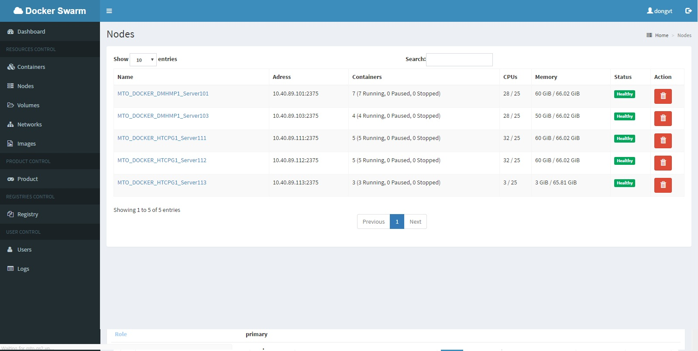
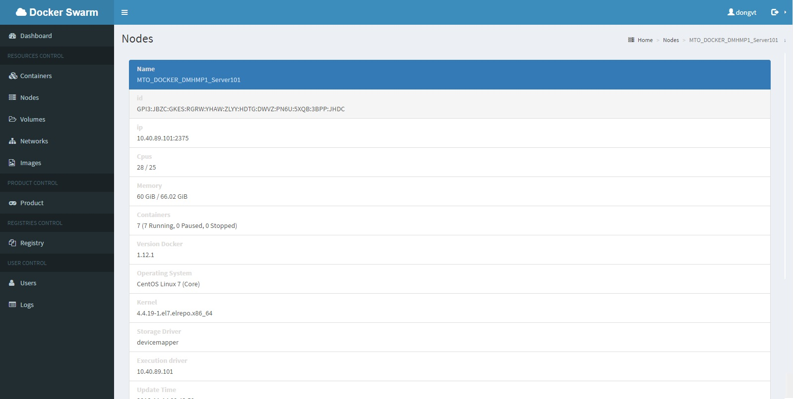
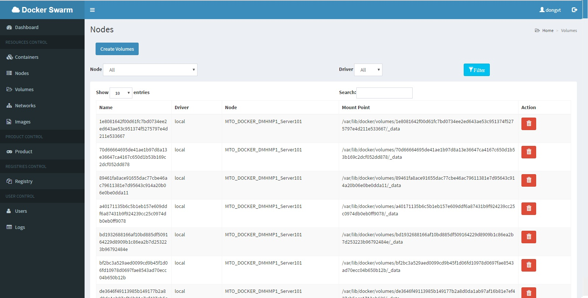

# Web control Docker Swarm
 
---
TODO: Được viết bằng python2.7 dùng framwork django(1.11) trên sử dụng database MySQL và API của Docker daemon để quản lý

## Usage

---

## Usage

- Dashboard
- Containers
- Nodes
- Volumes
- Networks
- Images
- Product
- Registry
- Users
- Logs


---

#### Dashboard


#### Containers


#### Nodes




#### Volumes


#### Networks


Tool được viết khá lâu so với hiện tại đầu năm 2016

```
Phát triển thêm sẽ khá hay vaf vui, dành cho những ai thích vọc vách,
NOTED: nên sài kubernetes cho lành AHIHI 
```

Thích vậy ý kiến gì !!!!!!!!!!!!!!!


## Installation
--
REQUEST:
OS : Centos 6.8 for master
OS : Centos 7.2 for ageent

---


### Master
- install python2.7
- install MySQL
- install Django 1.11
- install Gunicorm
- install Nginx
- install Swarm Master
- install Consul
- install Source code Web

### Agent
- install Docker Engine
- install Swarm Agent

##### install python2.7


`cd source_setup/
rpm -ivh python-2.7.11-1.x86_64.rpm
`

##### install MySQL


`yum install mysql-devel mysql mysql-server
`

##### install Django 1.11


`cd source_setup/
unzip django-master.zip
/build/python2.7/bin/python2.7  django-master/setup.py install
unzip  MySQL-python-1.2.5.zip
/build/python2.7/bin/python2.7  MySQL-python-1.2.5/setup.py install
tar -xvf requests-2.11.1.tar.gz
/build/python2.7/bin/python2.7  requests-2.11.1/setup.py install
`


##### install Gunicorm


`cd source_setup/
tar -xvf gunicorn-19.6.0.tar.gz
/build/python2.7/bin/python2.7  gunicorn-19.6.0/setup.py install
`

Configure gunicorn


`vim /etc/init.d/gunicorn
`


```
#! /bin/bash
#Author Dongvt-VNG

USER=root
GROUP=root
WORKERS=4
APPMODULE="dockerui.wsgi"
BASE_DIR="/data/www/html/"
PATH=/bin:/usr/bin:/sbin:/usr/sbin
DAEMON="/build/python2.7/bin/gunicorn"
PIDFILE="/var/run/gunicorn.pid"

#pid exists, check if running
declare -i PS=`ps aux | grep $DAEMON | wc -l`
. /etc/init.d/functions
case "$1" in
  start)
		if [ $PS -gt 1 ] && [ -f $PIDFILE ]; then
		   echo ${ps_pig}
		   echo -e "Server already running $APPMODULE \e[0;31m[Error]\e[0m"
		else
			echo -e "Start Server $APPMODULE \e[1;32m[OK]\e[0m"
			cd $BASE_DIR
        		$DAEMON  --pid=$PIDFILE  --user=$USER --group=$GROUP   --reload --chdir=$BASE_DIR --bind 127.0.0.1:9000  --log-level=debug --access-logfile=$LOG_DIR/access.log --error-logfile=$LOG_DIR/error.log  --backlog=1024 --workers=$WORKERS --worker-class=sync --threads=1 --worker-connections=1024 --timeout=120 --graceful-timeout=120 --keep-alive=5 --daemon  $APPMODULE
		fi	
    ;;
  stop)
		if [ $PS -gt 1 ]  && [ -f $PIDFILE ]; then
		   echo -e "Stopping Server $APPMODULE \e[1;32m[OK]\e[0m"
		   killall gunicorn
		   rm -f $PIDFILE
		else
		   echo -e "Server $APPMODULE Not Running \e[0;31m[FAIL]\e[0m"			
		fi


    ;;
  force-reload|restart)
    $0 stop
    $0 start
    ;;
  status)
    status_of_proc -p $PIDFILE $DAEMON && exit 0 || exit $?
    ;;
  *)
    echo "Usage: /etc/init.d/gunicorn {start|stop|restart|force-reload|status}"
    exit 1
    ;;
esac

exit 0

```


`chmod +x /etc/init.d/gunicorn
`


##### install Nginx


`yum install nginx
`

Configure


`vim /etc/nginx/nginx.conf
`


```
user              www;
worker_processes  4;


events {
    worker_connections  1024;
}


http {
    default_type  application/octet-stream;
    include       /etc/nginx/mime.types;
    log_format  main  '$remote_addr - $remote_user [$time_local] "$request" '
                      '$status $body_bytes_sent "$http_referer" '
                      '"$http_user_agent" "$http_x_forwarded_for"';


    sendfile        on;
    keepalive_timeout  65;

    gzip  on;
    access_log /data/www/logs/nginx_access.log;
    error_log /data/www/logs/nginx_error.log;

        server {
                        listen  80;
                        return 444;
                        }


    include /etc/nginx/site-enabled/gunicorn.conf;

}

```


`vim /etc/nginx/site-enabled/gunicorn.conf
`

```
server {
        listen       80;
        server_name mto.gs2.vn;
        access_log on;

        location /static/ {
                alias /data/www/html/swarm_ui/static/;
        }

        location / {
                proxy_pass http://127.0.0.1:9000;
        }

        error_page   500 502 503 504  /50x.html;
        location = /50x.html {
            root   html;
        }


}

```


`chkconfig nginx on
/etc/init.d/nginx restart
`

##### install Swarm Master


`cd source_setup/
cp swarm_master / -R
chmod +x /swarm_master/*
`


Sửa thông tin trong file configure cho phù hợp

`vim /swarm_master/swarm_manager`

```
ip_host="10.40.89.10"
ip_consul="10.40.89.11"
port_docker_host="12375"
port_consul="8500"
host=$(hostname)
```


`cd /swarm_master/
./swarm_manager start
echo "cd /swarm_master/ && ./swarm_manager start" >> /etc/rc.local
`


##### install Consul
[Cài đặt Consul](https://gitlab.g6.zing.vn/dongvt/docker/blob/master/discovery_service/consul_doc.txt)

Cấu hình consul

`mkdir /data/consul.d/bootstrap -p
vim /data/consul.d/bootstrap/config.json
`


```
{
    "bootstrap": true,
    "server": true,
    "datacenter": "gs2",
    "data_dir": "/data/consul.d/data",
    "log_level": "INFO",
    "enable_syslog": true,
    "disable_update_check": true,
    "client_addr": "0.0.0.0",
    "ports": {
        "dns": 8600
    }
}

```
Start:


`nohup consul agent -server  -bootstrap -config-dir=/data/consul.d/bootstrap &
`

##### install Docker Engine

[Update kernel cho HOST](https://gitlab.g6.zing.vn/dongvt/docker/blob/master/tunning_update_kernel_centos7.txt)
[Cài đặt Docker daemon cho HOST](https://gitlab.g6.zing.vn/dongvt/docker/blob/master/docker.txt)

[File configure docker Daemon cho Product](https://gitlab.g6.zing.vn/dongvt/docker/blob/master/configure_docker_mto/docker_deamon.txt)

[Cấu hình Direct LVM cho docker daemon](https://gitlab.g6.zing.vn/dongvt/docker/blob/master/configure_docker_mto/docker_direct-lvm.txt)


##### install Swarm Agent

`cd source_setup/
cp swarm_agent / -R
chmod +x /swarm_agent/*
`


Sửa thông tin trong file configure cho phù hợp

`vim /swarm_agent/swarm_join`

```
consul="consul"
ip_host="10.40.89.113"
ip_consul="10.40.89.11"
port1="2375"
port2="8500"
host="MTO_DOCKER_HTCPG1_Server113"
```


`cd /swarm_agent/
./swarm_join start
echo "cd /swarm_agent/ && ./swarm_join start" >> /etc/rc.local
`

##### install Source code Web

`mkdir /data/www/html/ -p
mkdir /data/www/logs/
cp dockerui swarm_ui manage.py upload /data/www/html/ -R

`

Sửa thông số cho phù hợp

`vim /data/www/html/dockerui/settings.py`

```
DATABASES = {
    'default': {
        'ENGINE': 'django.db.backends.mysql',
        'NAME': 'dockerui',
	    'USER': 'root',
        'PASSWORD': '',
        'HOST': '',
        'PORT': '3306',
    }
}
API_DOCKER_SWARM = {
    'PROTOCOL':'http',
    'HOST':'10.40.89.10',
    'PORT':'12375',
}

API_CONSUL_MANAGER = {
    'PROTOCOL':'http',
    'HOST':'10.40.89.11',
    'PORT':'8500',
}
```

Tạo database trên MySQL
`mysql -uroot -p -P3306 -e 'create database dockerui'`

Import structure database dockerui vao
`mysql -uroot -p -P3306 dockerui < source_setup/dockerui.sql`

## Start web server WSGI Gunicorm Tận hưởng thành quả
RUN:

`/etc/init.d/gunicorn start`

user/pass defaule admin/admin

---

